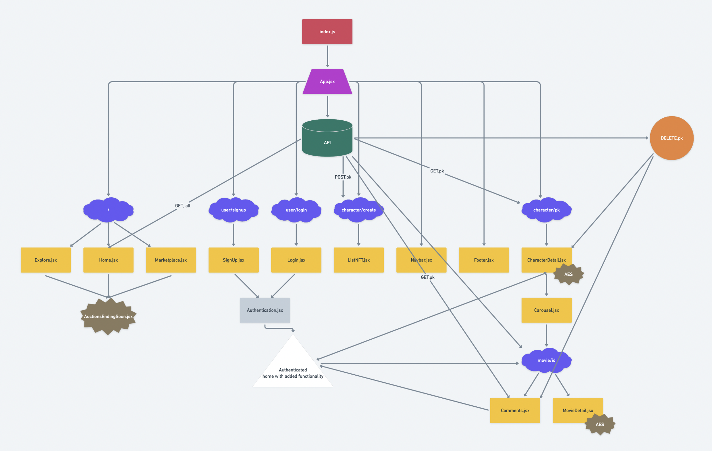
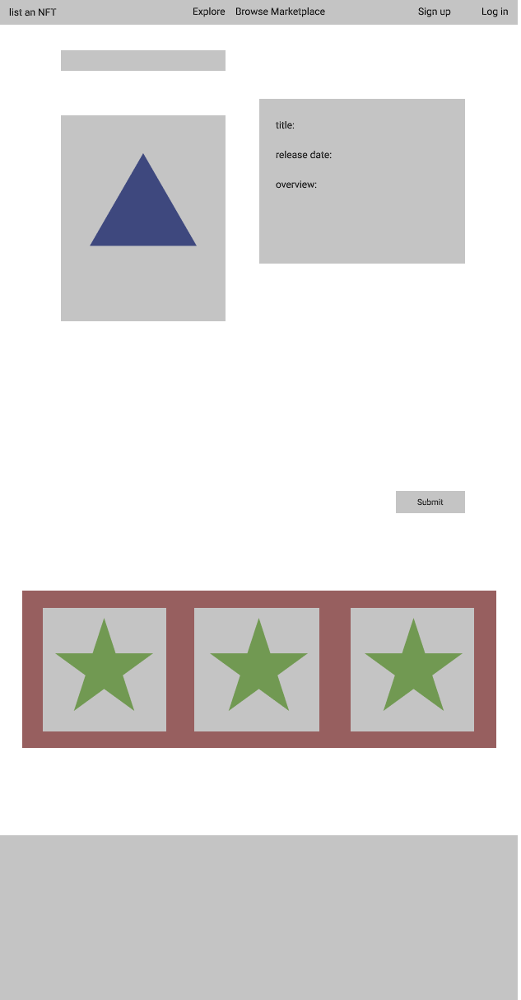
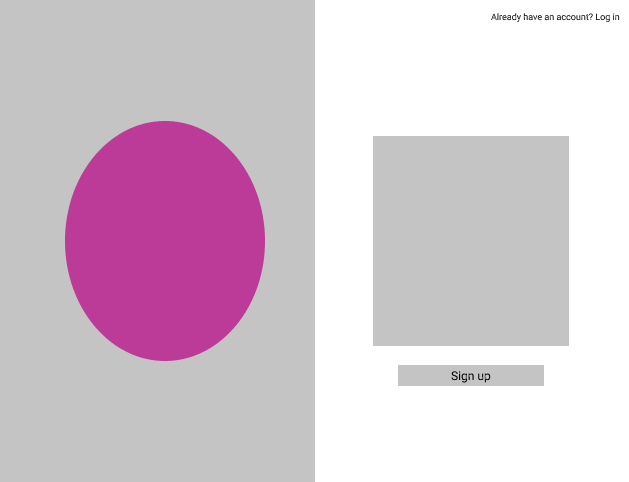
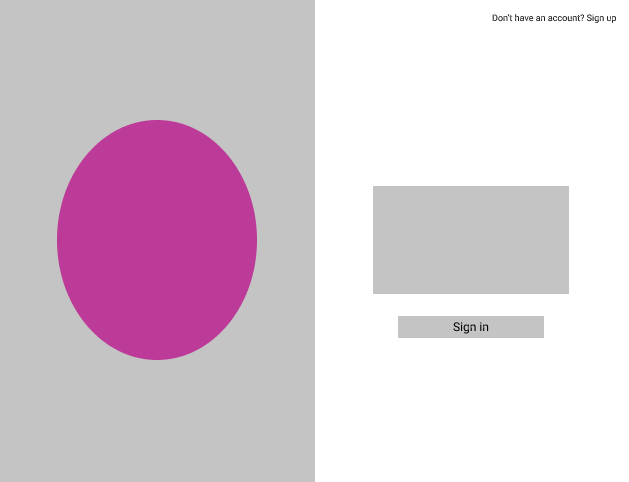
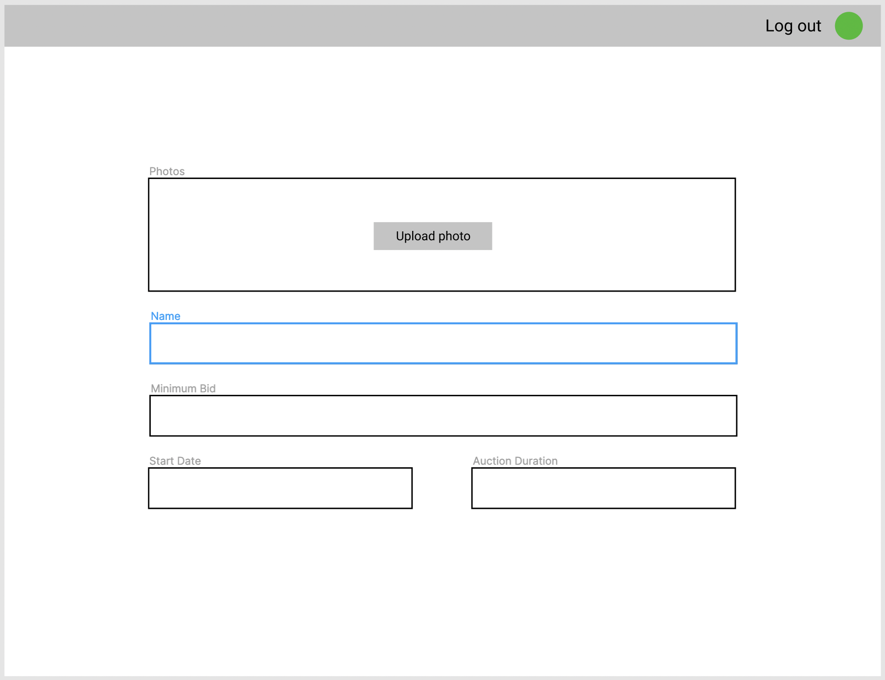
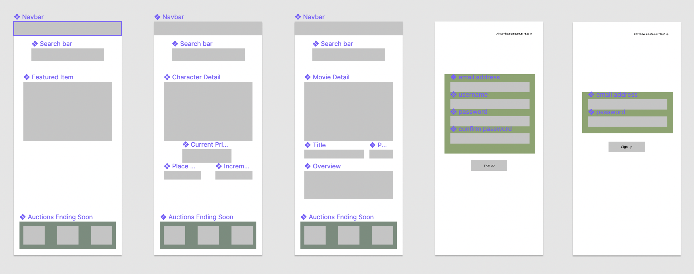
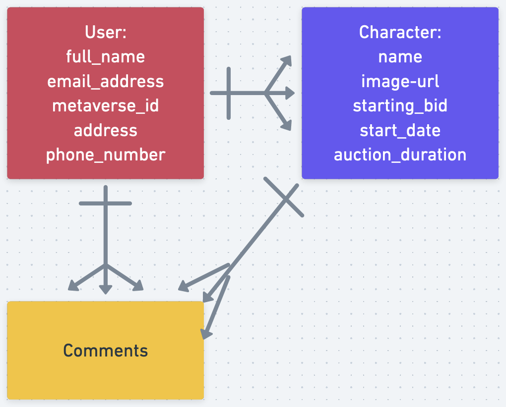

# Django-Cinematic-Metaverse

Django Cinematic Metaverse is an NFT platform designed for comic book fans to buy and sell superhero NFTs. While on the platform, users can browse around to find out more information about their favorite characters as well as all of the movies they've starred in throughout the inception of the franchise.

We use a bidding process to purchase NFTs. There will be a timeframe for users to place bids. The highest bidder at the time of expiration becomes the proud, new owner of this great piece of art.

Bidders will be using the SHA coin created and developed by the anonymous Mr. Shamalik. No one knows anything about his identity. All they know he create a fully robust, secure token that will be recognized and used on many other platforms in the future.

## Wireframes

https://whimsical.com/Sf6nNpC7fAY63YVNeSxZyW



## Component Hierarchy

https://www.figma.com/file/UeiMeG3AKHzdRcwubPO9Sz/Django-Cinematic-Universe?node-id=0%3A1

MacBook Pro










Media Query



## Dependencies

django

psycopg2-binary

Pillow

django_extensions

autopep8

djangorestframework

pytz

djangorestframework-simplejwt

gunicorn

whitenoise

python-dotenv

dj-database-url

react-router-dom

## API and Data Sample

```
class Avatar(models.Model):
    username = models.CharField(max_length=128)
    email_address = models.EmailField()
    home_address = models.CharField(max_length=128)
    city = models.CharField(max_length=60)
    state_province = models.CharField(max_length=30)
    phone_number = PhoneField(blank=True, help_text='Contact phone number')

    def __str__(self):
        return self.username

class Character(models.Model):
    name = models.CharField(max_length=128)
    image_url = models.URLField(max_length=200)
    current_bid = models.CharField(max_length=128)
    start_date = forms.DateField(initial=datetime.date.today, label="Start Date")
    auction_duration = forms.ChoiceField(choices=INTERVAL_CHOICES, initial='one_day', label="Interval")

    def __str__(self):
        return self.name


class Movie(models.Model):
    title = models.ForeignKey(Character, on_delete=models.CASCADE, related_name='titles')
    directors = models.ManyToManyField('Director')
    publication_date = models.DateField()
    overview = models.CharField(max_length=1000)

    def __str__(self):
        return self.title
```

## Entity Relationship Database



#### MVP

Crate a marketplace where fans can purchase NFTs, list an NFT for sale or just browse around to learn things about their favorite characters.

#### PostMVP

Add trailers to movie page.

Related films. Create movie class.

Reviews.

Allow users to upload actual images from their file explorer.

## Project Schedule

| Day    | Deliverable       | Status    |
| ------ | ----------------- | --------- |
| Jan 24 | Proposal Approval | Completed |
| Jan 25 | Backend Creation  | Completed |
| Jan 26 | Frontend Creation | Completed |
| Jan 27 | CSS Components    | Completed |
| Jan 28 | Heroku Setup      | Completed |
| Jan 31 | Presentations     | Pending   |

## Timeframes

| Component                   | Priority | Estimated Time | Time Invested | Actual Time |
| --------------------------- | :------: | :------------: | :-----------: | :---------: |
| Proposal                    |    H     |      2hrs      |     2hrs      |    2hrs     |
| Data population / Home      |    H     |      3hrs      |     3hrs      |    4hrs     |
| Data population / Character |    H     |      3hrs      |     2hrs      |    4hrs     |
| Data population / Movie     |    H     |      3hrs      |     2hrs      |    4hrs     |
| Data creation / Home        |    H     |      3hrs      |     3hrs      |    4hrs     |
| Data creation / Character   |    H     |      3hrs      |      1hr      |    4hrs     |
| Data creation / Movie       |    H     |      3hrs      |      1hr      |    4hrs     |
| Comments section            |    H     |      3hrs      |     2hrs      |    3hrs     |
| Component CSS pg 1          |    H     |      4hrs      |     4hrs      |    5hrs     |
| Component CSS pg 2          |    H     |      4hrs      |     4hrs      |    4hrs     |
| Component CSS pg 3          |    H     |      4hrs      |     4hrs      |    4hrs     |
| Clickable icons             |    H     |      1hrs      |      1hr      |    1hrs     |
| Heroku setup                |    H     |      5hrs      |      1hr      |    5hrs     |
| Total                       |    H     |     41hrs      |     30hrs     |    48hrs    |

## SWOT Analysis

### Strengths:

I feel as if I am pretty decent with CSS if I allow myself enough time.

### Weaknesses:

I ran into some issues trying to get components to render in React the last time I did a project. I have watched a few tutorials on YouTube regarding this process over the course of the last few weeks.

### Opportunities:

I'm pretty decent with configuring authentication and backend. I may run into some issues when it's time to deploy to Heroku. I will work hard at trying to figure things out by reading documentation.

### Threats:

Trying to be perfect! I will have fun with this project. There will be plenty of time for me to add features and functionality to the site after the bootcamp ends.

### Code Showcase

```
code snippet here
```

### Code Issues & Resolutions

> Use this section to list of all major issues encountered and their resolution, if you'd like.
